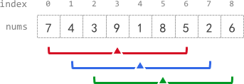

# 滑动窗口

## 定长滑动窗口

滑动窗口长度固定为 k。

```go
for l, r := 0, 0; r < len(s); r++ {
    ...

    if r-l+1 == k {
		...
        
        l++
    }
}
```

[1456. 定长子串中元音的最大数目](https://leetcode.cn/problems/maximum-number-of-vowels-in-a-substring-of-given-length/)

给定字符串 s 和整数 k，返回字符串 s 中长度为 k 的单个子字符串中可能包含的最大元音字母数。

英文中的元音字母为 a, e, i, o, u。

**示例 1：**

```
输入：s = "abciiidef", k = 3
输出：3
解释：子字符串 "iii" 包含 3 个元音字母。
```

**示例 2：**

```
输入：s = "rhythms", k = 4
输出：0
解释：字符串 s 中不含任何元音字母。
```

**解题：**

```go
/* 1456. 定长子串中元音的最大数目 */
func maxVowels(s string, k int) int {
	vowels := []byte{'a', 'e', 'i', 'o', 'u'}
	count, ans := 0, 0
	for l, r := 0, 0; r < len(s); r++ {
		if bytes.ContainsRune(vowels, rune(s[r])) {
			count++
		}

		if r-l+1 == k {
			ans = max(ans, count)
			if ans == k {
				break
			}

			if bytes.ContainsRune(vowels, rune(s[l])) {
				count--
			}
			l++
		}
	}
    
	return ans
}
```

[643. 子数组最大平均数 I](https://leetcode.cn/problems/maximum-average-subarray-i/)

给定一个由 n 个元素组成的整数数组 nums 和一个整数 k，找出平均数最大且长度为 k 的连续子数组，输出该最大平均数。

**示例 1：**

```
输入：nums = [1,12,-5,-6,50,3], k = 4
输出：12.75
解释：最大平均数 (12-5-6+50)/4 = 51/4 = 12.75
```

**示例 2：**

```
输入：nums = [5], k = 1
输出：5.00000
```

**解题：**

```go
/* 643. 子数组最大平均数 I */
func findMaxAverage(nums []int, k int) float64 {
	ans, sum := -math.MaxFloat64, 0
	for l, r := 0, 0; r < len(nums); r++ {
		sum += nums[r]

		if r-l+1 == k {
			ans = max(ans, float64(sum)/float64(k))

			sum -= nums[l]
			l++
		}
	}

	return ans
}
```

[1343. 大小为 K 且平均值大于等于阈值的子数组数目](https://leetcode.cn/problems/number-of-sub-arrays-of-size-k-and-average-greater-than-or-equal-to-threshold/)

给定一个整数数组 arr 和两个整数 k 和 threshold，返回长度为 k 且平均值大于等于 threshold 的子数组数目。

**示例 1：**

```
输入：arr = [2,2,2,2,5,5,5,8], k = 3, threshold = 4
输出：3
解释：子数组 [2,5,5],[5,5,5] 和 [5,5,8] 的平均值分别为 4，5 和 6。
```

**示例 2：**

```
输入：arr = [11,13,17,23,29,31,7,5,2,3], k = 3, threshold = 5
输出：6
解释：前 6 个长度为 3 的子数组平均值都大于 5。
```

**解题：**

```go
/* 1343. 大小为 K 且平均值大于等于阈值的子数组数目 */
func numOfSubarrays(arr []int, k int, threshold int) int {
	sum, count := 0, 0
	for l, r := 0, 0; r < len(arr); r++ {
		sum += arr[r]

		if r-l+1 == k {
			if threshold*k <= sum {
				count++
			}

			sum -= arr[l]
			l++
		}
	}

	return count
}
```

[2090. 半径为 k 的子数组平均值](https://leetcode.cn/problems/k-radius-subarray-averages/)

给定一个下标从 0 开始的数组 nums，数组中有 n 个整数，且给定一个整数 k。

半径为 k 的子数组平均值是指：nums 中一个以下标 i 为中心且半径为 k 的子数组中所有元素的平均值，如果在下标 i 前或后不足 k 个元素，则半径为 k 的子数组平均值是 -1。

构建并返回一个长度为 n 的数组 avgs，其中 avgs[i] 是以下标 i 为中心的子数组的半径为 k 的子数组平均值。

**示例 1：**



```
输入：nums = [7,4,3,9,1,8,5,2,6], k = 3
输出：[-1,-1,-1,5,4,4,-1,-1,-1]
```

**示例 2：**

```
输入：nums = [100000], k = 0
输出：[100000]
```

**示例 3：**

```
输入：nums = [8], k = 100000
输出：[-1]
```

**解题：**

```go
/* 2090. 半径为 k 的子数组平均值 */
func getAverages(nums []int, k int) []int {
	avg := make([]int, len(nums))
	for i := range avg {
		avg[i] = -1
	}

	sum := 0
	for l, r := 0, 0; r < len(nums); r++ {
		sum += nums[r]

		if r-l == 2*k {
			avg[(l+r)/2] = sum / (2*k + 1)

			sum -= nums[l]
			l++
		}
	}

	return avg
}
```

[2379. 得到 K 个黑块的最少涂色次数](https://leetcode.cn/problems/minimum-recolors-to-get-k-consecutive-black-blocks/)

给定一个长度为 n 下标从 0 开始的字符串 blocks，blocks[i] 要么是 'W' 要么是 'B'，表示第 i 块的颜色。字符 'W' 和 'B' 分别表示白色和黑色。

给定一个整数 k，表示想要连续黑色块的数目。每一次操作中，可以选择一个白色块将它涂成黑色块，返回至少出现一次连续 k 个黑色块的最少操作次数。

**示例 1：**

```
输入：blocks = "WBBWWBBWBW", k = 7
输出：3
解释：
一种得到 7 个连续黑色块的方法是把第 0，3 和 4 个块涂成黑色，得到 blocks = "BBBBBBBWBW"。
```

**示例 2：**

```
输入：blocks = "WBWBBBW", k = 2
输出：0
```

**解题**：

寻找长度为 k 的固定滑动窗口中 'W' 的数量。

```go
/* 2379. 得到 K 个黑块的最少涂色次数 */
func minimumRecolors(blocks string, k int) int {
	count, ans := 0, math.MaxInt
	for l, r := 0, 0; r < len(blocks); r++ {
		if blocks[r] == 'W' {
			count++
		}

		if r-l+1 == k {
			ans = min(ans, count)

			if blocks[l] == 'W' {
				count--
			}
			l++
		}
	}

	return ans
}
```

[2841. 几乎唯一子数组的最大和](https://leetcode.cn/problems/maximum-sum-of-almost-unique-subarray/)

给定一个整数数组 nums 和两个正整数 m 和 k。

返回 nums 中长度为 k 的几乎唯一子数组的最大和，如果不存在几乎唯一子数组，请返回 0。

nums 的一个子数组有至少 m 个互不相同的元素，则称它是几乎唯一子数组。

**示例 1：**

```
输入：nums = [2,6,7,3,1,7], m = 3, k = 4
输出：18
解释：总共有 3 个长度为 k = 4 的几乎唯一子数组。分别为 [2, 6, 7, 3]，[6, 7, 3, 1] 和 [7, 3, 1, 7]。这些子数组中，和最大的是 [2, 6, 7, 3]，和为 18。
```

**示例 2：**

```
输入：nums = [5,9,9,2,4,5,4], m = 1, k = 3
输出：23
解释：总共有 5 个长度为 k = 3 的几乎唯一子数组。分别为 [5, 9, 9]，[9, 9, 2]，[9, 2, 4]，[2, 4, 5] 和 [4, 5, 4]。这些子数组中，和最大的是 [5, 9, 9]，和为 23。
```

**示例 3：**

```
输入：nums = [1,2,1,2,1,2,1], m = 3, k = 3
输出：0
解释：输入数组中不存在长度为 k = 3 的子数组含有至少 m = 3 个互不相同元素的子数组。
```

**解题：**

使用 map 统计重复的数字。

```go
/* 2841. 几乎唯一子数组的最大和 */
func maxSum(nums []int, m int, k int) int64 {
	duplicate := make(map[int]int, len(nums))
	sum, ans := 0, 0
	for l, r := 0, 0; r < len(nums); r++ {
		sum += nums[r]
		duplicate[nums[r]]++

		if r-l+1 == k {
			if len(duplicate) >= m {
				ans = max(ans, sum)
			}

			sum -= nums[l]
			duplicate[nums[l]]--
			if duplicate[nums[l]] == 0 {
				delete(duplicate, nums[l])
			}
			l++
		}
	}

	return int64(ans)
}
```

[2461. 长度为 K 子数组中的最大和](https://leetcode.cn/problems/maximum-sum-of-distinct-subarrays-with-length-k/)

给定一个整数数组 nums 和一个整数 k，请从 nums 中满足下述条件的全部子数组中找出最大子数组和：

- 子数组的长度是 k。
- 子数组中的所有元素各不相同。

返回满足题面要求的最大子数组和，如果不存在子数组满足这些条件返回 0。

**示例 1：**

```
输入：nums = [1,5,4,2,9,9,9], k = 3
输出：15
解释：nums 中长度为 3 的子数组是：
- [1,5,4] 满足全部条件，和为 10。
- [5,4,2] 满足全部条件，和为 11。
- [4,2,9] 满足全部条件，和为 15。
- [2,9,9] 不满足全部条件，因为元素 9 出现重复。
- [9,9,9] 不满足全部条件，因为元素 9 出现重复。
因为 15 是满足全部条件的所有子数组中的最大子数组和，所以返回 15。
```

**示例 2：**

```
输入：nums = [4,4,4], k = 3
输出：0
解释：nums 中长度为 3 的子数组是：
- [4,4,4] 不满足全部条件，因为元素 4 出现重复。
因为不存在满足全部条件的子数组，所以返回 0。
```

**解题：**

```go
/* 2461. 长度为 K 子数组中的最大和 */
func maximumSubarraySum(nums []int, k int) int64 {
	duplicate := make(map[int]int, len(nums))
	sum, ans := 0, 0
	for l, r := 0, 0; r < len(nums); r++ {
		sum += nums[r]
		duplicate[nums[r]]++

		if r-l+1 == k {
			if len(duplicate) == k {
				ans = max(ans, sum)
			}

			sum -= nums[l]
			duplicate[nums[l]]--
			if duplicate[nums[l]] == 0 {
				delete(duplicate, nums[l])
			}
			l++
		}
	}

	return int64(ans)
}
```

[1423. 可获得的最大点数](https://leetcode.cn/problems/maximum-points-you-can-obtain-from-cards/)

几张卡牌排成一行，每张卡牌都有一个对应的点数。

每次行动，可以从行的开头或者末尾拿一张卡牌，最终必须正好拿 k 张卡牌，返回可以获得的最大点数。

**示例 1：**

```
输入：cardPoints = [1,2,3,4,5,6,1], k = 3
输出：12
解释：第一次行动，不管拿哪张牌，点数总是 1。但是，先拿最右边的卡牌将会最大化可获得点数。最优策略是拿右边的三张牌，最终点数为 1 + 6 + 5 = 12。
```

**示例 2：**

```
输入：cardPoints = [2,2,2], k = 2
输出：4
解释：无论拿起哪两张卡牌，可获得的点数总是 4。
```

**示例 3：**

```
输入：cardPoints = [9,7,7,9,7,7,9], k = 7
输出：55
解释：必须拿起所有卡牌，可以获得的点数为所有卡牌的点数之和。
```

**示例 4：**

```
输入：cardPoints = [1,1000,1], k = 1
输出：1
解释：你无法拿到中间那张卡牌，所以可以获得的最大点数为 1。 
```

**示例 5：**

```
输入：cardPoints = [1,79,80,1,1,1,200,1], k = 3
输出：202
```

**解题：**

使得左或右抽取的点数最大，等价于中间剩余滑动窗口的点数最小。

```go
/* 1423. 可获得的最大点数 */
func maxScore(cardPoints []int, k int) int {
	sum, ans := 0, math.MaxInt
	total := 0
	for l, r := 0, 0; r < len(cardPoints); r++ {
		sum += cardPoints[r]
		total += cardPoints[r]

		if r-l+1 == len(cardPoints)-k {
			ans = min(sum, ans)

			sum -= cardPoints[l]
			l++
		}
	}

	if len(cardPoints)-k == 0 {
		ans = 0
	}

	return total - ans
}
```

## 不定长滑动窗口

```go
for l, r := 0, 0; r < len(s); r++ {
    ...

    for condition {
		...
        
        l++
    }
}
```

### 越长越合法/求最长/最大

[3. 无重复字符的最长子串](https://leetcode.cn/problems/longest-substring-without-repeating-characters/)

给定一个字符串 s，找出其中不含有重复字符的最长子串的长度。

**示例 1:**

```
输入: s = "abcabcbb"
输出: 3 
解释: 因为无重复字符的最长子串是 "abc"，所以其长度为 3。注意 "bca" 和 "cab" 也是正确答案。
```

**示例 2:**

```
输入: s = "bbbbb"
输出: 1
解释: 因为无重复字符的最长子串是 "b"，所以其长度为 1。
```

**示例 3:**

```
输入: s = "pwwkew"
输出: 3
解释: 因为无重复字符的最长子串是 "wke"，所以其长度为 3。
     请注意，你的答案必须是子串的长度，"pwke" 是一个子序列，不是子串。
```

**解题：**

使用 map 统计重复的数字，当 map 中存在重复数字时不满足滑动窗口条件。

```go
/* 3. 无重复字符的最长子串 */
func lengthOfLongestSubstring(s string) int {
	duplicate := make(map[rune]int, len(s))
	count := 0
	for l, r := 0, 0; r < len(s); r++ {
		duplicate[rune(s[r])]++

		for duplicate[rune(s[r])] > 1 {
			duplicate[rune(s[l])]--
			l++
		}

		count = max(count, r-l+1)
	}
	
	return count
}
```

[3090. 每个字符最多出现两次的最长子字符串](https://leetcode.cn/problems/maximum-length-substring-with-two-occurrences/)

给定一个字符串 s，找出满足每个字符最多出现两次的最长子字符串，并返回该子字符串的最大长度。

**示例 1：**

```
输入：s = "bcbbbcba"
输出：4
解释：以下子字符串长度为 4，并且每个字符最多出现两次："bcbbbcba"。
```

**示例 2：**

```
输入：s = "aaaa"
输出：2
解释：以下子字符串长度为 2，并且每个字符最多出现两次："aaaa"。
```

**解题：**

使用 map 统计重复的数字，当 map 中存在重复数字次数大于 2 时不满足滑动窗口条件。

```go
/* 3090. 每个字符最多出现两次的最长子字符串 */
func maximumLengthSubstring(s string) int {
	duplicate := make(map[rune]int, len(s))
	count := 0
	for l, r := 0, 0; r < len(s); r++ {
		duplicate[rune(s[r])]++

		for duplicate[rune(s[r])] > 2 {
			duplicate[rune(s[l])]--
			l++
		}

		count = max(count, r-l+1)
	}

	return count
}
```

[1493. 删掉一个元素以后全为 1 的最长子数组](https://leetcode.cn/problems/longest-subarray-of-1s-after-deleting-one-element/)

给定一个二进制数组 nums，需要从中删掉一个元素，在删掉元素的结果数组中，返回最长的且只包含 1 的非空子数组的长度。

如果不存在这样的子数组，请返回 0。

**示例 1：**

```
输入：nums = [1,1,0,1]
输出：3
解释：删掉位置 2 的数后，[1,1,1] 包含 3 个 1。
```

**示例 2：**

```
输入：nums = [0,1,1,1,0,1,1,0,1]
输出：5
解释：删掉位置 4 的数字后，[0,1,1,1,1,1,0,1] 的最长全 1 子数组为 [1,1,1,1,1]。
```

**示例 3：**

```
输入：nums = [1,1,1]
输出：2
解释：你必须要删除一个元素。
```

**解题：**

需要确保 0 的个数 0 <= count <= 1，否则滑动窗口不成立。

```go
/* 1493. 删掉一个元素以后全为 1 的最长子数组 */
func longestSubarray(nums []int) int {
	count, ans := 0, 0
	for l, r := 0, 0; r < len(nums); r++ {
		if nums[r] == 0 {
			count++
		}

		for count > 1 {
			if nums[l] == 0 {
				count--
			}
			l++
		}

		ans = max(ans, r-l)
	}

	return ans
}
```

[3634. 使数组平衡的最少移除数目](https://leetcode.cn/problems/minimum-removals-to-balance-array/)

给定一个整数数组 nums 和一个整数 k。

如果一个数组的最大元素的值至多是其最小元素的 k 倍，则该数组被称为是平衡的。

可以从 nums 中移除任意数量的元素，但不能使其变为空数组，返回为了使剩余数组平衡，需要移除的元素的最小数量。

**示例 1:**

```
输入：nums = [2,1,5], k = 2
输出：1
解释：移除 nums[2] = 5 得到 nums = [2, 1]。现在 max = 2, min = 1，且 max <= min * k，因为 2 <= 1 * 2。因此，答案是 1。
```

**示例 2:**

```
输入：nums = [1,6,2,9], k = 3
输出：2
解释：移除 nums[0] = 1 和 nums[3] = 9 得到 nums = [6, 2]。现在 max = 6, min = 2，且 max <= min * k，因为 6 <= 2 * 3。因此，答案是 2。
```

**示例 3:**

```
输入：nums = [4,6], k = 2
输出：0
解释：由于 nums 已经平衡，因为 6 <= 4 * 2，所以不需要移除任何元素。
```

**解题：**

首先将 nums 进行排序，保证 nums[l] * k < nums[r] 为滑动窗口的条件。

```go
/* 3634. 使数组平衡的最少移除数目 */
func minRemoval(nums []int, k int) int {
	slices.Sort(nums)

	maxSave := 0
	for l, r := 0, 0; r < len(nums); r++ {
		for nums[l]*k < nums[r] {
			l++
		}

		maxSave = max(maxSave, r-l+1)
	}

	return len(nums) - maxSave
}
```

[1208. 尽可能使字符串相等](https://leetcode.cn/problems/get-equal-substrings-within-budget/)

给定两个长度相同的字符串 s 和 t。

将 s 中的第 i 个字符变到 t 中的第 i 个字符需要 |s[i] - t[i]| 的开销，用于变更字符串的最大预算是 maxCost。如果可以将 s 的子字符串转化为它在 t 中对应的子字符串，则返回可以转化的最大长度。

**示例 1：**

```
输入：s = "abcd", t = "bcdf", maxCost = 3
输出：3
解释：s 中的 "abc" 可以变为 "bcd"。开销为 3，所以最大长度为 3。
```

**示例 2：**

```
输入：s = "abcd", t = "cdef", maxCost = 3
输出：1
解释：s 中的任一字符要想变成 t 中对应的字符，其开销都是 2。因此，最大长度为 1。
```

**示例 3：**

```
输入：s = "abcd", t = "acde", maxCost = 0
输出：1
解释：a -> a, cost = 0，字符串未发生变化，所以最大长度为 1。
```

**解题：**

创建一个新的 costs 数组，其中保存转化成对应字符的花销，滑动窗口中的总花销应小于 maxCost。

```go
/* 1208. 尽可能使字符串相等 */
func equalSubstring(s string, t string, maxCost int) int {
	costs := make([]int, len(s))
	for i := range s {
		diff := int(s[i]) - int(t[i])
		if diff > 0 {
			costs[i] = diff
		} else {
			costs[i] = -diff
		}
	}

	total, ans := 0, 0
	for l, r := 0, 0; r < len(costs); r++ {
		total += costs[r]

		for total > maxCost {
			total -= costs[l]
			l++
		}

		ans = max(ans, r-l+1)
	}

	return ans
}
```

[904. 水果成篮](https://leetcode.cn/problems/fruit-into-baskets/)

农场从左到右种植了一排果树，这些树用一个整数数组 fruits 表示，其中 fruits[i] 是第 i 棵树上的水果种类。

- 只有两个篮子，并且每个篮子只能装单一类型的水果，但每个篮子能够装的水果总量没有限制。
- 可以选择任意一棵树开始采摘，必须从每棵树上恰好摘一个水果，每采摘一次，将会向右移动到下一棵树，并继续采摘。
- 一旦走到某棵树前，但水果不符合篮子的水果类型，就必须停止采摘。

给定一个整数数组 fruits，返回可以收集的水果的最大数目。

**示例 1：**

```
输入：fruits = [1,2,1]
输出：3
解释：可以采摘全部 3 棵树。
```

**示例 2：**

```
输入：fruits = [0,1,2,2]
输出：3
解释：可以采摘 [1,2,2] 这三棵树。
如果从第一棵树开始采摘，则只能采摘 [0,1] 这两棵树。
```

**示例 3：**

```
输入：fruits = [1,2,3,2,2]
输出：4
解释：可以采摘 [2,3,2,2] 这四棵树。
如果从第一棵树开始采摘，则只能采摘 [1,2] 这两棵树。
```

**示例 4：**

```
输入：fruits = [3,3,3,1,2,1,1,2,3,3,4]
输出：5
解释：可以采摘 [1,2,1,1,2] 这五棵树。
```

**解题：**

滑动窗口中需要保持种类只有两种。

```go
/* 904. 水果成篮 */
func totalFruit(fruits []int) int {
	duplicate := make(map[int]int, len(fruits))
	count := 0
	for l, r := 0, 0; r < len(fruits); r++ {
		duplicate[fruits[r]]++

		for len(duplicate) > 2 {
			duplicate[fruits[l]]--
			if duplicate[fruits[l]] == 0 {
				delete(duplicate, fruits[l])
			}
			l++
		}
		
		count = max(count, r-l+1)
	}
	return count
}
```

[1695. 删除子数组的最大得分](https://leetcode.cn/problems/maximum-erasure-value/)

给定一个正整数数组 nums，从中删除一个含有若干不同元素的子数组，删除子数组的得分就是子数组各元素之和，返回只删除一个子数组可获得的最大得分。

**示例 1：**

```
输入：nums = [4,2,4,5,6]
输出：17
解释：最优子数组是 [2,4,5,6]
```

**示例 2：**

```
输入：nums = [5,2,1,2,5,2,1,2,5]
输出：8
解释：最优子数组是 [5,2,1] 或 [1,2,5]
```

**解题：**

保证滑动窗口中不出现重复元素。

```go
/* 1695. 删除子数组的最大得分 */
func maximumUniqueSubarray(nums []int) int {
	duplicate := make(map[int]int)
	sum, ans := 0, 0
	for l, r := 0, 0; r < len(nums); r++ {
		sum += nums[r]
		duplicate[nums[r]]++

		for duplicate[nums[r]] > 1 {
			sum -= nums[l]
			duplicate[nums[l]]--
			l++
		}

		ans = max(ans, sum)
	}
	return ans
}
```

[2958. 最多 K 个重复元素的最长子数组](https://leetcode.cn/problems/length-of-longest-subarray-with-at-most-k-frequency/)

给定一个整数数组 nums 和一个整数 k。

如果一个数组中所有元素的频率都小于等于 k，则称这个数组是好数组，返回 nums 中最长好数组的长度。

**示例 1：**

```
输入：nums = [1,2,3,1,2,3,1,2], k = 2
输出：6
解释：最长好子数组是 [1,2,3,1,2,3]。
```

**示例 2：**

```
输入：nums = [1,2,1,2,1,2,1,2], k = 1
输出：2
解释：最长好子数组是 [1,2]。
```

**示例 3：**

```
输入：nums = [5,5,5,5,5,5,5], k = 4
输出：4
解释：最长好子数组是 [5,5,5,5]。
```

**解题：**

保证滑动窗口中重复元素出现不超过 k 次。

```go
/* 2958. 最多 K 个重复元素的最长子数组 */
func maxSubarrayLength(nums []int, k int) int {
	duplicate := make(map[int]int)
	ans := 0
	for l, r := 0, 0; r < len(nums); r++ {
		duplicate[nums[r]]++

		for duplicate[nums[r]] > k {
			duplicate[nums[l]]--
			l++
		}

		ans = max(ans, r-l+1)
	}
	
	return ans
}
```

[2024. 考试的最大困扰度](https://leetcode.cn/problems/maximize-the-confusion-of-an-exam/)

一位老师正在出一场由 n 道判断题构成的考试，每道题的答案为 true（用 'T' 表示）或者 false（用 'F' 表示）。

给定一个字符串 answerKey，其中 answerKey[i] 是第 i 个问题的正确结果。除此以外，还给定一个整数 k，表示能进行操作的最多次数，每次操作可将将问题的正确答案改为 'T' 或者 'F'。 

返回在不超过 k 次操作的情况下，最大连续 'T' 或者 'F' 的数目。

**示例 1：**

```
输入：answerKey = "TTFF", k = 2
输出：4
解释：可以将两个 'F' 都变为 'T'，得到 answerKey = "TTTT"。
```

**示例 2：**

```
输入：answerKey = "TFFT", k = 1
输出：3
解释：可以将最前面的 'T' 换成 'F'，得到 answerKey = "FFFT"。
或者可以将第二个 'T' 换成 'F'，得到 answerKey = "TFFF"。
两种情况下，都有三个连续的 'F'。
```

**示例 3：**

```
输入：answerKey = "TTFTTFTT", k = 1
输出：5
解释：可以将第一个 'F' 换成 'T'，得到 answerKey = "TTTTTFTT"。
或者我们可以将第二个 'F' 换成 'T'，得到 answerKey = "TTFTTTTT"。
两种情况下，都有五个连续的 'T' 。
```

**解题：**

滑动窗口中保证 'T' 或 'F' 的次数不超过 k。

```go
/* 2024. 考试的最大困扰度 */
func maxConsecutiveAnswers(answerKey string, k int) int {
	duplicate := make(map[rune]int, 2)
	count := 0
	for l, r := 0, 0; r < len(answerKey); r++ {
		duplicate[rune(answerKey[r])]++

		for duplicate[rune('T')] > k && duplicate[rune('F')] > k {
			duplicate[rune(answerKey[l])]--
			l++
		}

		count = max(count, r-l+1)
	}
	
	return count
}
```

[1004. 最大连续1的个数 III](https://leetcode.cn/problems/max-consecutive-ones-iii/)

给定一个二进制数组 nums 和一个整数 k，假设最多可以翻转 k 个 0，则返回执行操作后数组中连续 1 的最大个数。

**示例 1：**

```
输入：nums = [1,1,1,0,0,0,1,1,1,1,0], K = 2
输出：6
```

**示例 2：**

```
输入：nums = [0,0,1,1,0,0,1,1,1,0,1,1,0,0,0,1,1,1,1], K = 3
输出：10
```

**解题：**

保证滑动窗口中 0 的数量不超过 k。

```go
/* 1004. 最大连续1的个数 III */
func longestOnes(nums []int, k int) int {
	count, ans := 0, 0
	for l, r := 0, 0; r < len(nums); r++ {
		if nums[r] == 0 {
			count++
		}

		for count > k {
			if nums[l] == 0 {
				count--
			}
			l++
		}

		ans = max(ans, r-l+1)
	}

	return ans
}
```

### 越短越合法/求最短/最小

[209. 长度最小的子数组](https://leetcode.cn/problems/minimum-size-subarray-sum/)

给定一个含有 n 个正整数的数组和一个正整数 target。

找出该数组中满足其总和大于等于 target 的长度最小的子数组并返回其长度，如果不存在符合条件的子数组则返回 0。

**示例 1：**

```
输入：target = 7, nums = [2,3,1,2,4,3]
输出：2
解释：子数组 [4,3] 是该条件下的长度最小的子数组。
```

**示例 2：**

```
输入：target = 4, nums = [1,4,4]
输出：1
```

**示例 3：**

```
输入：target = 11, nums = [1,1,1,1,1,1,1,1]
输出：0
```

**解题：**

```go
/* 209. 长度最小的子数组 */
func minSubArrayLen(target int, nums []int) int {
	sum, minLen := 0, math.MaxInt
	for l, r := 0, 0; r < len(nums); r++ {
		sum += nums[r]

		for sum >= target {
			minLen = min(minLen, r-l+1)
			
			sum -= nums[l]
			l++
		}
	}

	if minLen == math.MaxInt {
		return 0
	}

	return minLen
}
```

[3795. 不同元素和至少为 K 的最短子数组长度](https://leetcode.cn/problems/minimum-subarray-length-with-distinct-sum-at-least-k/)

给定一个整数数组 nums 和一个整数 k，返回一个子数组的最小长度，使得该子数组中出现的不同值之和至少为 k，如果不存在这样的子数组，则返回 -1。

**示例 1：**

```
输入：nums = [2,2,3,1], k = 4
输出：2
解释：子数组 [2, 3] 具有不同的元素 {2, 3}，它们的和为 2 + 3 = 5，这至少为 k = 4。因此，答案是 2。
```

**示例 2：**

```
输入：nums = [3,2,3,4], k = 5
输出：2
解释：子数组 [3, 2] 具有不同的元素 {3, 2}，它们的和为 3 + 2 = 5，这至少为 k = 5。因此，答案是 2。
```

**示例 3：**

```
输入：nums = [5,5,4], k = 5
输出：1
解释：子数组 [5] 具有不同的元素 {5}，它们的和为 5，这至少为 k = 5。因此，答案是 1。
```

**解题：**

应该保证滑动窗口内数的和 sum < k，且确保每个重复数只被计算一次。

```go
/* 3795. 不同元素和至少为 K 的最短子数组长度 */
func minLength(nums []int, k int) int {
	duplicate := make(map[int]int, len(nums))
	sum, minLen := 0, math.MaxInt
	for l, r := 0, 0; r < len(nums); r++ {
		duplicate[nums[r]]++
		if duplicate[nums[r]] == 1 {
			sum += nums[r]
		}

		for sum >= k {
			minLen = min(minLen, r-l+1)

			duplicate[nums[l]]--
			if duplicate[nums[l]] == 0 {
				sum -= nums[l]
			}
			
			l++
		}
	}

	if minLen == math.MaxInt {
		return -1
	}

	return minLen
}
```

[2904. 最短且字典序最小的美丽子字符串](https://leetcode.cn/problems/shortest-and-lexicographically-smallest-beautiful-string/)

给定一个二进制字符串 s 和一个正整数 k。

如果 s 的某个子字符串中 1 的个数恰好等于 k，则称这个子字符串是一个美丽子字符串。令 len 等于最短美丽子字符串的长度，返回长度等于 len 且字典序最小的美丽子字符串。如果 s 中不含美丽子字符串，则返回一个空字符串。

**示例 1：**

```
输入：s = "100011001", k = 3
输出："11001"
解释：示例中共有 7 个美丽子字符串：
1. 子字符串 "100011001"。
2. 子字符串 "100011001"。
3. 子字符串 "100011001"。
4. 子字符串 "100011001"。
5. 子字符串 "100011001"。
6. 子字符串 "100011001"。
7. 子字符串 "100011001"。
最短美丽子字符串的长度是 5。
长度为 5 且字典序最小的美丽子字符串是子字符串 "11001"。
```

**示例 2：**

```
输入：s = "1011", k = 2
输出："11"
解释：示例中共有 3 个美丽子字符串：
1. 子字符串 "1011"。
2. 子字符串 "1011"。
3. 子字符串 "1011"。
最短美丽子字符串的长度是 2。
长度为 2 且字典序最小的美丽子字符串是子字符串 "11"。 
```

**示例 3：**

```
输入：s = "000", k = 1
输出：""
解释：示例中不存在美丽子字符串。
```

**解题：**

注意需要返回最短且字典序最小的美丽子字符串，因此更新答案时会首先比较长度，若长度一致时会比较字典序。

```go
/* 2904. 最短且字典序最小的美丽子字符串 */
func shortestBeautifulSubstring(s string, k int) string {
	count, ans := 0, []int{math.MaxInt, -1, -1}
	for l, r := 0, 0; r < len(s); r++ {
		if s[r] == '1' {
			count++
		}

		for count >= k {
			if ans[0] > r-l+1 || ans[0] == r-l+1 && s[ans[1]:ans[2]+1] > s[l:r+1] {
				ans = []int{r - l + 1, l, r}
			}

			if s[l] == '1' {
				count--
			}
			
			l++
		}
	}

	if ans[0] == math.MaxInt {
		return ""
	}

	return s[ans[1] : ans[2]+1]
}
```

[1234. 替换子串得到平衡字符串](https://leetcode.cn/problems/replace-the-substring-for-balanced-string/)

有一个只含有 'Q', 'W', 'E', 'R' 四种字符，且长度为 n 的字符串。假如在该字符串中，这四个字符都恰好出现 n/4 次，那么它就是一个平衡字符串。

给定一个字符串 s，可以通过替换一个子串的方式，使原字符串 s 变成一个平衡字符串。可以用和待替换子串长度相同的任何其他字符串来完成替换。

请返回待替换子串的最小可能长度，如果原字符串自身就是一个平衡字符串，则返回 0。

**示例 1：**

```
输入：s = "QWER"
输出：0
解释：s 已经是平衡的了。
```

**示例 2：**

```
输入：s = "QQWE"
输出：1
解释：需要把一个 'Q' 替换成 'R'，这样得到的 "RQWE"（或 "QRWE"）是平衡的。
```

**示例 3：**

```
输入：s = "QQQW"
输出：2
解释：可以把前面的 "QQ" 替换成 "ER"。 
```

**示例 4：**

```
输入：s = "QQQQ"
输出：3
解释：可以替换后 3 个 'Q'，使 s = "QWER"。
```

**解题：**

滑动窗口内是需要替换的字符，只有当滑动窗口外的字符个数都小于所需要时才可以进行替换。

```go
/* 1234. 替换子串得到平衡字符串 */
func balancedString(s string) int {
	duplicate := make(map[rune]int, 4)
	needLen, ans := len(s)/4, math.MaxInt

	for _, data := range s {
		duplicate[data]++
	}

	if duplicate[rune('Q')] == needLen &&
		duplicate[rune('W')] == needLen &&
		duplicate[rune('E')] == needLen &&
		duplicate[rune('R')] == needLen {
		return 0

	}

	for l, r := 0, 0; r < len(s); r++ {
		duplicate[rune(s[r])]--

		for duplicate[rune('Q')] <= needLen &&
			duplicate[rune('W')] <= needLen &&
			duplicate[rune('E')] <= needLen &&
			duplicate[rune('R')] <= needLen {
			ans = min(ans, r-l+1)
			duplicate[rune(s[l])]++
			l++
		}
	}

	return ans
}
```

[2875. 无限数组的最短子数组](https://leetcode.cn/problems/minimum-size-subarray-in-infinite-array/)

给定一个下标从 0 开始的数组 nums 和一个整数 target。下标从 0 开始的数组 infinite_nums 是通过无限地将 nums 的元素追加到自己之后生成的。

请从 infinite_nums 中找出满足元素和等于 target 的最短子数组，并返回该子数组的长度。如果不存在满足条件的子数组，返回 -1 。

**示例 1：**

```
输入：nums = [1,2,3], target = 5
输出：2
解释：在这个例子中 infinite_nums = [1,2,3,1,2,3,1,2,...]。
区间 [1,2] 内的子数组的元素和等于 target = 5 ，且长度 length = 2。
可以证明，当元素和等于目标值 target = 5 时，2 是子数组的最短长度。
```

**示例 2：**

```
输入：nums = [1,1,1,2,3], target = 4
输出：2
解释：在这个例子中 infinite_nums = [1,1,1,2,3,1,1,1,2,3,1,1,...]。
区间 [4,5] 内的子数组的元素和等于 target = 4 ，且长度 length = 2。
可以证明，当元素和等于目标值 target = 4 时，2 是子数组的最短长度。
```

**示例 3：**

```
输入：nums = [2,4,6,8], target = 3
输出：-1
解释：在这个例子中 infinite_nums = [2,4,6,8,2,4,6,8,...]。
可以证明，不存在元素和等于目标值 target = 3 的子数组。
```

**解题：**

target 可由两部分组成：n 次数组的和 + 两个拼接的 nums 中的子数组。

```go
/* 2875. 无限数组的最短子数组 */
func minSizeSubarray(nums []int, target int) int {
	totalSum := 0
	for _, num := range nums {
		totalSum += num
	}

	circle := target / totalSum * len(nums)
	target = target % totalSum

	sum, ans := 0, math.MaxInt
	nums = append(nums, nums...)
	for l, r := 0, 0; r < len(nums); r++ {
		sum += nums[r]

		for sum > target {
			sum -= nums[l]
			l++
		}

		if sum == target {
			ans = min(ans, r-l+1)
		}
	}

	if ans == math.MaxInt {
		return -1
	}
	
	return circle + ans
}
```

[76. 最小覆盖子串](https://leetcode.cn/problems/minimum-window-substring/)

给定两个字符串 s 和 t，长度分别是 m 和 n。返回 s 中的最短窗口子串，使得该子串包含 t 中的每一个字符（包括重复字符）。如果没有这样的子串，返回空字符串 ""。

**示例 1：**

```
输入：s = "ADOBECODEBANC", t = "ABC"
输出："BANC"
解释：最小覆盖子串 "BANC" 包含来自字符串 t 的 'A'、'B' 和 'C'。
```

**示例 2：**

```
输入：s = "a", t = "a"
输出："a"
解释：整个字符串 s 是最小覆盖子串。
```

**示例 3:**

```
输入: s = "a", t = "aa"
输出: ""
解释: t 中两个字符 'a' 均应包含在 s 的子串中，因此没有符合条件的子字符串，返回空字符串。
```

**解题：**

统计 t 需要出现的字符个数，当满足要求时进行统计。

```go
/* 76. 最小覆盖子串 */
func minWindow(s string, t string) string {
	need, valid := make(map[rune]int), 0
	for _, b := range t {
		need[rune(b)]++
	}

	total, ans := make(map[rune]int), [2]int{0, math.MaxInt}
	for l, r := 0, 0; r < len(s); r++ {
		total[rune(s[r])]++
		if total[rune(s[r])] == need[rune(s[r])] {
			valid++
		}

		for valid == len(need) && l < len(s) {
			len := min(ans[1]-ans[0], r-l+1)
			if len == r-l+1 {
				ans = [2]int{l, r + 1}
			}

			if total[rune(s[l])] == need[rune(s[l])] {
				valid--
			}
			total[rune(s[l])]--
			l++
		}
	}

	if ans[1] == math.MaxInt {
		return ""
	}

	return s[ans[0]:ans[1]]
}
```

[632. 最小区间](https://leetcode.cn/problems/smallest-range-covering-elements-from-k-lists/)

存在 k 个非递减排列的整数列表，找到一个最小区间，使得 k 个列表中的每个列表至少有一个数包含在其中。

定义如果 b-a < d-c 或者在 b-a == d-c 时 a < c，则区间 [a,b] 比 [c,d] 小。

**示例 1：**

```
输入：nums = [[4,10,15,24,26], [0,9,12,20], [5,18,22,30]]
输出：[20,24]
解释： 
列表 1：[4, 10, 15, 24, 26]，24 在区间 [20,24] 中。
列表 2：[0, 9, 12, 20]，20 在区间 [20,24] 中。
列表 3：[5, 18, 22, 30]，22 在区间 [20,24] 中。
```

**示例 2：**

```
输入：nums = [[1,2,3],[1,2,3],[1,2,3]]
输出：[1,1]
```

**解题：**

将第一个数组元素的下标标记为 0，第二个数组元素的下标标记为 1，依次类推。然后将所有元素进行排序，可以得到两个数组，第一个是由元素组成的数组 [0, 4, 5, ...]，第二个数组是由下标标记的数组 [1, 0, 2, ...]。

目标是找到一个滑动窗口，使其包含下标标记数组的 0 - k-1 的所有编号。 

```go
/* 632. 最小区间 */
func smallestRange(nums [][]int) []int {
	type pair struct{ x, i int }
	pairs := []pair{}
	for i, arr := range nums {
		for _, x := range arr {
			pairs = append(pairs, pair{x, i})
		}
	}
	slices.SortFunc(pairs, func(a, b pair) int { return a.x - b.x })
	ans := [2]pair{
		{x: pairs[0].x, i: 0},
		{x: pairs[len(pairs)-1].x, i: len(pairs) - 1},
	}

	valid := 0
	duplicate := make(map[int]int, len(nums))
	for l, r := 0, 0; r < len(pairs); r++ {
		duplicate[pairs[r].i]++
		if duplicate[pairs[r].i] == 1 {
			valid++
		}

		for valid == len(nums) && l < len(pairs) {
			need := false
			if ans[1].x-ans[0].x == pairs[r].x-pairs[l].x {
				if pairs[l].x < ans[0].x {
					need = true
				}
			} else {
				minLen := min(ans[1].x-ans[0].x, pairs[r].x-pairs[l].x)
				if minLen == pairs[r].x-pairs[l].x {
					need = true
				}
			}

			if need {
				ans = [2]pair{
					{x: pairs[l].x, i: l},
					{x: pairs[r].x, i: r},
				}
			}

			if duplicate[pairs[l].i] == 1 {
				valid--
			}
			duplicate[pairs[l].i]--
			l++
		}
	}

	return []int{ans[0].x, ans[1].x}
}
```
